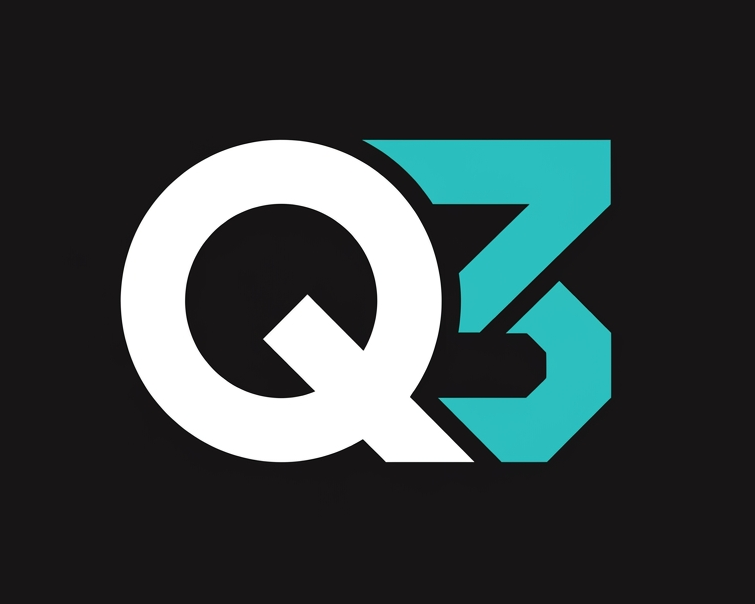

<p align="center">
  
</p>

# Q3 IDE

A standalone, heavily modified VS Code fork with a deeply integrated offline AI agent powered by **Qwen 3 Coder**. No cloud dependencies — all inference runs locally via ik_llama.cpp and llama-swap.

## Features

- **Offline AI Agent** — Chat, code completion, refactoring, and multi-step agentic workflows powered by Qwen 3 Coder running locally
- **Inline Completions** — Ghost text suggestions using fill-in-the-middle (FIM) prompts
- **Inline Diff Editor** — Agent-proposed edits show as green/red diff decorations directly in the editor with per-file approve/deny buttons
- **Agentic Tools** — `read_file`, `list_dir`, `grep_search`, `apply_edit`, `batch_edit`, `write_file`, `run_command`, `git_status`, `git_commit`, `read_diagnostics` — with auto-approve for read-only operations
- **Batch Edits** — Apply multiple edits to a single file in one tool call, reducing LLM round-trips
- **Privacy First** — Zero network calls for AI inference. Your code never leaves your machine
- **Based on VS Code** — Full compatibility with VS Code extensions via Open VSX registry

## Architecture

```
Q3 IDE (Electron) → llama-swap (:8080, TTL 300s) → ik_llama.cpp llama-server (dynamic port)
```

- **llama-swap** — Reverse proxy with on-demand model swapping and TTL auto-unload
- **ik_llama.cpp** — llama.cpp fork with fused MoE ops, better CPU+GPU hybrid performance, FlashMLA, speculative decoding
- **Model** — Qwen3-30B-A3B-Instruct-2507-UD-Q4_K_XL.gguf (Unsloth Dynamic GGUF)

### Optimized inference flags

```
llama-server.exe \
  --model Qwen3-30B-A3B-Instruct-2507-UD-Q4_K_XL.gguf \
  --ctx-size 16384 \
  --n-gpu-layers 99 \
  -ot ".ffn_.*_exps.=CPU" \
  -ctk q8_0 -ctv q8_0 \
  --flash-attn on \
  --jinja \
  -np 1 \
  --port 8080
```

## Quick Start

### Prerequisites

- [Node.js](https://nodejs.org/) (see `.nvmrc` for required version)
- [Python](https://www.python.org/) (for native module builds)
- [Git](https://git-scm.com/)
- [llama-swap](https://github.com/mostlygeek/llama-swap) (`winget install mostlygeek.llama-swap` on Windows)
- [ik_llama.cpp](https://github.com/ikawrakow/ik_llama.cpp) built from source (or use your own llama.cpp fork)
- NVIDIA GPU with CUDA 12.6+ (recommended for MoE models)
- Windows: Visual Studio 2022 with C++ workload
- macOS: Xcode Command Line Tools
- Linux: `build-essential`, `libx11-dev`, `libxkbfile-dev`, `libsecret-1-dev`

### Build from Source

> **Note:** This repo intentionally excludes files that can be regenerated or installed — `node_modules/`, native `.node`/`.dll` binaries, compiled `out/` output, Copilot test simulation cache `.sqlite` files, and the generated Q3 Agent copies in `vscode/src/vs/workbench/.../q3Agent/`. The `dev/apply_q3agent.sh` step recreates the generated copies from `q3agent_src/` and builds the native modules.

```bash
# Clone this repo (no LFS files needed)
git clone https://github.com/Yeek-Ltd/Q3-ide.git
cd Q3-ide

# Install dependencies (skip postinstall scripts to avoid hangs on Windows)
cd vscode
npm install --ignore-scripts
cd ..

# Apply Q3 agent patches and build native modules
# (Git Bash / WSL on Windows; uses bash scripts in dev/)
bash dev/apply_q3agent.sh

# Compile the workbench in dev mode (outputs to vscode/out/)
cd vscode
npx gulp compile

# Launch the IDE in dev mode
# Windows:
.\scripts\code.bat
# macOS/Linux:
./scripts/code.sh
```

On first run, Q3 IDE will auto-configure `llama-swap` and attempt to load the configured GGUF model (default: `qwen3-coder:30b`). Place your model at `~/.q3ide/models/` or set `q3.agent.llamacpp.modelPath` in settings.


### Download Pre-built

Download the latest release from [GitHub Releases](https://github.com/Yeek-Ltd/Q3-ide/releases).

## Configuration

| Setting | Default | Description |
|---------|---------|-------------|
| `q3.agent.model` | `qwen3-coder:30b` | Model name for llama-swap |
| `q3.agent.temperature` | `0.7` | LLM temperature |
| `q3.agent.maxTokens` | `4096` | Max tokens per response |
| `q3.agent.maxSteps` | `30` | Max agentic loop iterations |
| `q3.agent.warmUpModel` | `true` | Pre-load model into GPU on startup |
| `q3.agent.llamacpp.modelPath` | — | Path to GGUF model file |
| `q3.agent.llamacpp.ctxSize` | `16384` | Context window size |
| `q3.agent.llamacpp.kvCacheType` | `q8_0` | KV cache quantization (f16/q8_0/q4_0) |
| `q3.agent.llamacpp.moeOffload` | `true` | Offload MoE expert layers to CPU |
| `q3.agent.llamacpp.gpuLayers` | `99` | GPU layer count (99 = all non-MoE) |
| `q3.agent.llamacpp.ttl` | `300` | Auto-unload idle model after N seconds |
| `q3.agent.llamacpp.llamaSwapPath` | — | Path to llama-swap binary |
| `q3.agent.llamacpp.serverBinaryPath` | — | Path to llama-server.exe |
| `q3.inlineCompletion.enabled` | `true` | Enable inline ghost text |
| `q3.inlineCompletion.maxTokens` | `128` | Max tokens per inline completion |

See the full [Architecture Document](ARCHITECTURE.md) for details.

## Links

- **Website**: [https://yeek.ltd](https://yeek.ltd)
- **GitHub**: [https://github.com/Yeek-Ltd/Q3-ide](https://github.com/Yeek-Ltd/Q3-ide)
- **Contact**: [contact@yeek.ltd](mailto:contact@yeek.ltd)

## License

MIT — See [LICENSE](LICENSE)